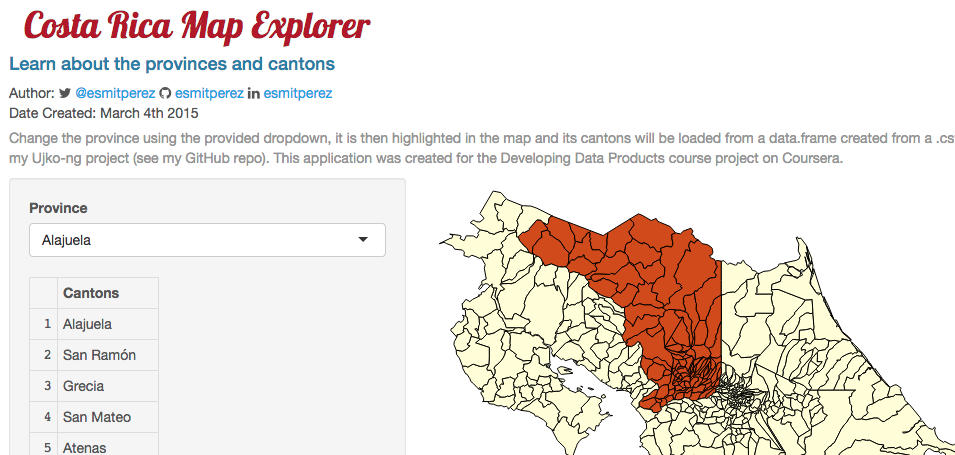

Costa Rica Map Explorer
========================================================
author: Esmit Perez (@esmitperez)
date: March 20th 2015
transition: rotate
font-import: http://fonts.googleapis.com/css?family=Josefin+Sans&subset=latin,latin-ext
font-family: 'Sans-Serif'

Introduction
========================================================
incremental: true

This educational application is hosted at [https://esmitperez.shinyapps.io/tiquimapa/](https://esmitperez.shinyapps.io/tiquimapa/), and allows users to explore the provinces, cantons and districts. 

These are the features offered:

- Choosing a province to view
- Province highlighting with canton shading


How does the UI work?
========================================================
incremental: true

Upon choosing a province, its code is sent back to `server.R` where it's looked up, finding the matching rows for that province and creating a `data.table` with the list of cantons to display.

A `colorTable` variable is populated with css styles, which indicate the svg nodes we want to highlight. These are matched using css selectors which match the specific nodes (already encoded with them)


Server code
========================================================
incremental: true

In `server.R`  the application loads a `.csv` file containing the data and creates a `data.frame` which we can then rely on:

```r
distritos <<- read.csv("../distritos.csv",fileEncoding="UTF-16", header = T)
# determine province ID
distritos$pCode <- substr(x = distritos$coddist, start = 1,stop = 1)
distritos$cCode <- as.numeric(substr(x = distritos$coddist, start = 2,stop = 3))

nrow(distritos)
```

```
[1] 474
```

Client side code
========================================================

Then in `ui.R` we can extract specifics codes and names like so:

```r
listaProvincias <- levels(distritos$provincia)
listaProvincias
```

```
[1] "Alajuela"   "Cartago"    "Guanacaste" "Heredia"    "Limón"     
[6] "Puntarenas" "San José"  
```


How does it look?
========================================================

User Interface preview
***



